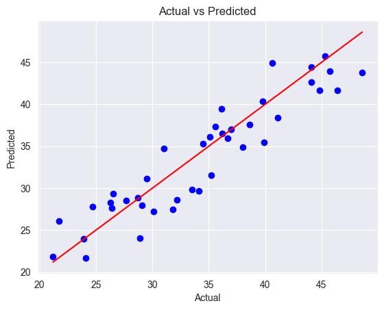

# Student Exam Score Prediction
This project predicts student exam scores based on features like hours studied, attendance, and previous performance using Linear Regression, Lasso, and Ridge models.
The dataset contains information about students:
- Features: hours studied, attendance, previous scores, etc.
- Target: exam_score
- Total rows: 200
1. Open `model.ipynb` in Jupyter Notebook.
2. Run cells step by step to train and evaluate the models.
3. Visualize predictions and metrics.
Linear Regression:
- MAE: 2.31
- MSE: 7.76
- R²: 0.854

Lasso Regression:
- MAE: 2.34
- MSE: 7.84
- R²: 0.852

Ridge Regression:
- MAE: 2.34
- MSE: 7.84
- R²: 0.852
The Linear Regression model fits the data best. The models show that the exam scores are strongly predictable based on the features provided. Residual analysis confirms a good fit.

